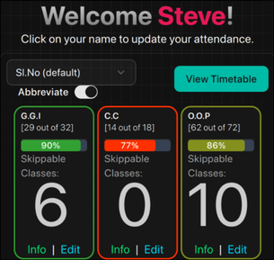

# 🎓 Amrita Attendance Fetcher

A modern browser extension that streamlines attendance tracking for Amrita University students by automatically extracting attendance data from the university portal and presenting it through an enhanced dashboard experience.


[](https://addons.mozilla.org/en-US/firefox/addon/amrita-attendance-fetcher/)


## 🚀 Usage

## 📦 Installation

### 🦊 Firefox + Android
click on the button below to install the extension directly from the Firefox Add-ons store:
<a href="https://addons.mozilla.org/en-US/firefox/addon/amrita-attendance-fetcher/" target="_blank">     

</a>
or [click here](https://addons.mozilla.org/en-US/firefox/addon/amrita-attendance-fetcher/) to visit the Firefox Add-ons page.


### 🌐 Edge (Under Review)

Currently under Microsoft Store review. Expected approval within 7 business days.

### 🔍 Chrome (Sponsorship Needed)

Chrome Web Store publication requires a $5 developer fee. Since I don't personally use Chrome, I haven't paid this fee yet. However, if you'd like to help make this extension available on Chrome, feel free to sponsor the project via [GitHub Sponsors](https://github.com/sponsors/nithitsuki)

### Quick Start
1. **Pin the extension** to your browser toolbar (recommended for easy access)
2. **Option A - Use Extension Popup**:
   - Click the extension icon in your toolbar
   - Click the **"[Get Attendance](marketing/popup.png)"** button
3. **Option B - Use Injected Button**:
   - Go to the [class attendance page](https://students.amrita.edu/client/class-attendance) on My amrita
   - Click the **"Go to Dashboard!"** button that appears automatically ([pic of the button](marketing/button.png))
4. **Option C - Use the sad.nithitsuki.com website**:
   - Visit [sad.nithitsuki.com](https://sad.nithitsuki.com)
   - Click on the **Red Text** to fetch your latest attendance data
   

### 🛠️ Local Installation (Devlprs)
```bash
git clone https://github.com/nithitsuki/attendance-grabber.git
cd attendance-grabber/wxt-port && pnpm i 
pnpx wxt zip -b firefox
# or `pnpx wxt zip` for soy browsers
```
## 📖 Documentation
Figure out the [wxt development](https://wxt.dev) yourself.

### Data Privacy
- ✅ **Local Processing**: All data extraction happens entirely in your browser
- ✅ **No Data Collection**: The extension doesn't collect, store, or transmit personal data
- ✅ **Temporary Storage**: Uses browser's local storage only for immediate data transfer
- ✅ **Open Source**: Complete code transparency for security review

## 📄 License

This project is licensed under the **MIT License** - see the [LICENSE](LICENSE) file for details.