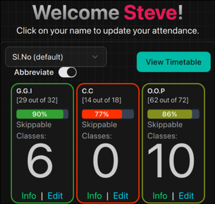

<div align="center">

# Amrita Attendance Fetcher

</div>


A modern browser extension that streamlines attendance tracking for Amrita University students by automatically extracting attendance data from the university portal and presenting it through an enhanced dashboard experience.

## Installation

[](https://addons.mozilla.org/en-US/firefox/addon/amrita-attendance-fetcher/) [](https://microsoftedge.microsoft.com/addons/detail/amrita-attendance-fetcher/eeccbjbcoakpcknafgkaopfhlhckknnm)
 <!-- []() -->

## Usage
### Quick Start
1. **Pin the extension** to your browser toolbar (recommended for easy access)
2. **Option A - Use Extension Popup**:
   - Click the extension icon in your toolbar
   - Click the **"[Get Attendance](marketing/popup.png)"** button
3. **Option B - Use Injected Button**:
   - Go to the [class attendance page](https://students.amrita.edu/client/class-attendance) on My amrita
   - Click the **"Go to Dashboard!"** button that appears automatically ([pic of the button](marketing/button.png))
4. **Option C - Use the sad.nithitsuki.com website**:
   - Visit [sad.nithitsuki.com](https://sad.nithitsuki.com)
   - Click on the **Red Text** (eg. Steve) to fetch your latest attendance data
   

### Local Installation (Developers)
```bash
git clone https://github.com/nithitsuki/attendance-grabber.git
cd attendance-grabber/wxt-port && bun i 
# Install bun, and checkout wxt docs for building and loading the extension in your browser
```

### Data Privacy
- **Local Processing**: All data extraction happens entirely in your browser
- **No Data Collection**: The extension doesn't collect, store, or transmit personal data
- **Temporary Storage**: Uses browser's local storage only for immediate data transfer
- **Open Source**: Complete code transparency for security review
