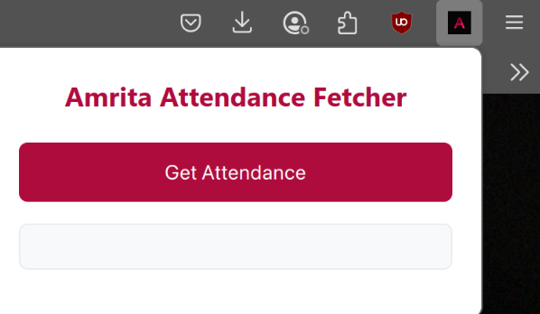
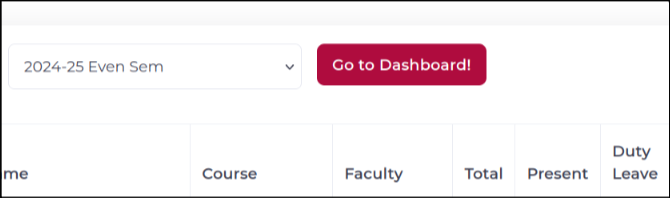
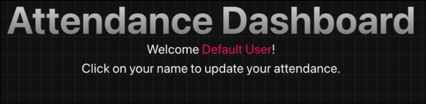

# 🎓 Amrita Attendance Fetcher

A modern browser extension that streamlines attendance tracking for Amrita University students by automatically extracting attendance data from the university portal and presenting it through an enhanced dashboard experience.


## 🚀 Usage

### Quick Start
1. **Pin the extension** to your browser toolbar (recommended for easy access)
2. **Option A - Use Extension Popup**:
   - Click the extension icon in your toolbar
   - Click the **"Get Attendance"** button
   
3. **Option B - Use Injected Button**:
   - Go to the [class attendance page](https://students.amrita.edu/client/class-attendance) on My amrita
   - Click the **"Go to Dashboard!"** button that appears automatically
   
4. **Option C - Use the sad.nithitsuki.com website**:
   - Visit [sad.nithitsuki.com](https://sad.nithitsuki.com)
   - Click on the **Red Text** to fetch your latest attendance data
   

## 📦 Installation

> **Note**: The extension is currently in development and not yet available on official browser stores. Install manually using the instructions below.

### Prerequisites
```bash
git clone https://github.com/nithitsuki/attendance-grabber.git
cd attendance-grabber
```

### 🦊 Firefox Installation
1. Open Firefox and navigate to `about:debugging#/runtime/this-firefox`
2. Click **"Load Temporary Add-on"**
3. Navigate to the cloned repository
4. Select the `manifest.json` file from the `FirefoxExtension` folder
5. The extension will be installed and active immediately

### 🌐 Chrome/Edge Installation
1. Open your browser and navigate to `chrome://extensions/`
2. Enable **"Developer mode"** in the top right corner
3. Click **"Load unpacked"**
4. Select the `ChromeExtension` folder from the cloned repository
5. The extension should now appear in your toolbar

### Data Privacy
- ✅ **Local Processing**: All data extraction happens entirely in your browser
- ✅ **No Data Collection**: The extension doesn't collect, store, or transmit personal data
- ✅ **Temporary Storage**: Uses browser's local storage only for immediate data transfer
- ✅ **Open Source**: Complete code transparency for security review

## 📄 License

This project is licensed under the **MIT License** - see the [LICENSE](LICENSE) file for details.